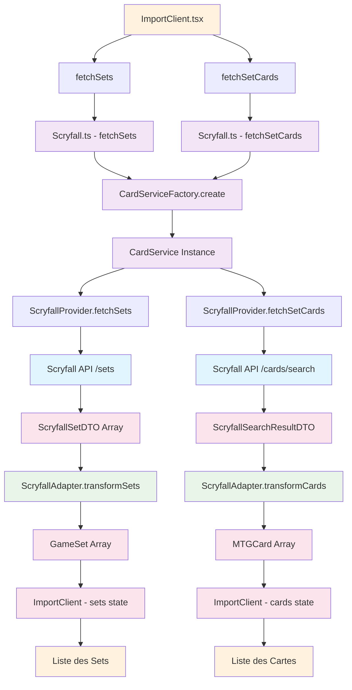

# Flux de Données - Cardfolio v2

## Diagramme du Flux de Données

## Description du Flux

### 1. **Interface Utilisateur (ImportClient.tsx)**
- L'utilisateur interagit avec l'interface
- Déclenche les appels `fetchSets()` et `fetchSetCards()`

### 2. **Services de Compatibilité (Scryfall.ts)**
- `fetchSets()` : Récupère tous les sets disponibles
- `fetchSetCards()` : Récupère les cartes d'un set spécifique
- Ces fonctions maintiennent la compatibilité avec l'ancien code

### 3. **Factory et Service Principal**
- `CardServiceFactory.create()` : Crée une instance du service
- `CardService` : Service principal qui orchestre les providers et adapters

### 4. **Provider (ScryfallProvider)**
- `fetchSets()` : Appel direct à l'API Scryfall `/sets`
- `fetchSetCards()` : Appel à l'API Scryfall `/cards/search`
- Gère les requêtes HTTP et la gestion d'erreurs

### 5. **API Externe (Scryfall)**
- Retourne les données brutes au format Scryfall
- `/sets` → Liste des sets
- `/cards/search` → Résultats de recherche de cartes

### 6. **Transformation (ScryfallAdapter)**
- `transformSets()` : Convertit `ScryfallSetDTO[]` → `GameSet[]`
- `transformCards()` : Convertit `ScryfallCardDTO[]` → `MTGCard[]`
- Normalise les données pour l'application

### 7. **Retour à l'Interface**
- Les données transformées sont stockées dans les états React
- `sets` : Liste des sets disponibles
- `cards` : Liste des cartes du set sélectionné

### 8. **Affichage**
- L'interface affiche les données formatées
- Liste des sets pour la sélection
- Liste des cartes pour l'import

## Types de Données

### Données Brutes (API)
- `ScryfallSetDTO` : Format Scryfall pour les sets
- `ScryfallCardDTO` : Format Scryfall pour les cartes
- `ScryfallSearchResultDTO` : Résultat de recherche Scryfall

### Données Transformées (Application)
- `GameSet` : Format unifié pour les sets
- `MTGCard` : Format unifié pour les cartes
- `CardServiceResponseDTO` : Réponse du service avec métadonnées

## Avantages de cette Architecture

1. **Séparation des responsabilités** : Chaque couche a un rôle spécifique
2. **Réutilisabilité** : Les providers et adapters peuvent être réutilisés
3. **Extensibilité** : Facile d'ajouter de nouveaux providers (MTGGoldfish, TCGPlayer)
4. **Maintenabilité** : Code organisé et modulaire
5. **Compatibilité** : L'ancien code continue de fonctionner
6. **Type Safety** : TypeScript assure la cohérence des types
