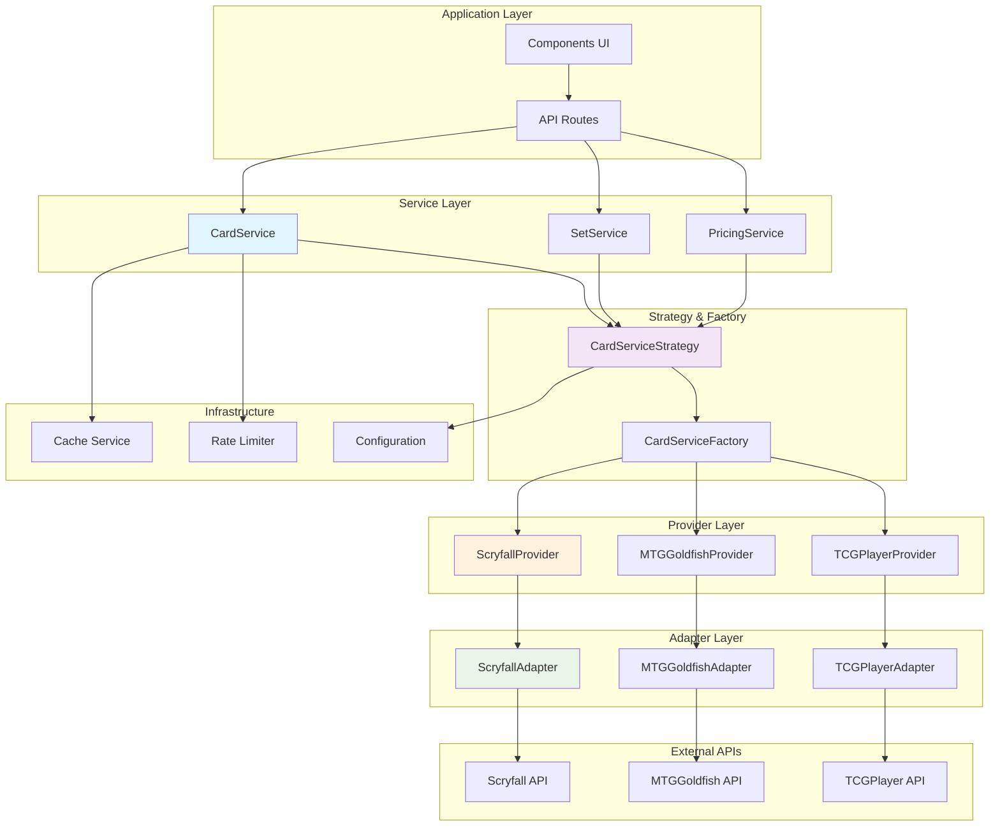
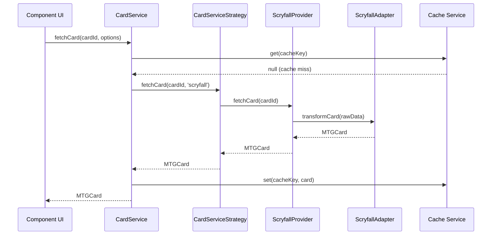

# Architecture Proposée : Service Layer pour APIs Tierces

## Diagramme d'Architecture



## Flux de Données



## Structure des Dossiers Proposée

```
src/
├── services/
│   ├── api/
│   │   ├── providers/
│   │   │   ├── ScryfallProvider.ts
│   │   │   ├── MTGGoldfishProvider.ts
│   │   │   └── TCGPlayerProvider.ts
│   │   ├── adapters/
│   │   │   ├── ScryfallAdapter.ts
│   │   │   ├── MTGGoldfishAdapter.ts
│   │   │   └── TCGPlayerAdapter.ts
│   │   ├── interfaces/
│   │   │   ├── ICardProvider.ts
│   │   │   ├── ISetProvider.ts
│   │   │   ├── IPricingProvider.ts
│   │   │   └── ICardAdapter.ts
│   │   ├── factory/
│   │   │   └── CardServiceFactory.ts
│   │   └── strategy/
│   │       └── CardServiceStrategy.ts
│   ├── infrastructure/
│   │   ├── cache/
│   │   │   └── CacheService.ts
│   │   ├── rate-limit/
│   │   │   └── RateLimitService.ts
│   │   └── config/
│   │       └── ServiceConfig.ts
│   ├── CardService.ts
│   ├── SetService.ts
│   └── PricingService.ts
└── types/
    ├── api/
    │   ├── scryfall.ts
    │   ├── mtggoldfish.ts
    │   └── tcgplayer.ts
    └── services/
        ├── CardServiceTypes.ts
        └── ServiceConfig.ts
```

## Avantages de cette Architecture

### 🎯 **Séparation des Responsabilités**
- **Providers** : Communication avec les APIs externes
- **Adapters** : Transformation des formats de données
- **Services** : Logique métier et orchestration
- **Strategy** : Sélection dynamique des providers

### 🔄 **Extensibilité**
- Ajout facile de nouvelles APIs
- Modification des adapters sans impact sur le reste
- Configuration dynamique des providers

### 🛡️ **Robustesse**
- Fallback automatique entre APIs
- Gestion des erreurs centralisée
- Rate limiting et cache intégrés

### 🧪 **Testabilité**
- Chaque composant peut être mocké
- Tests unitaires isolés
- Tests d'intégration par couche

### ⚡ **Performance**
- Cache intelligent avec TTL
- Rate limiting respectueux des APIs
- Requêtes parallèles quand possible

## Implémentation Progressive

### Phase 1 : Refactoring Existant
1. Créer les interfaces de base
2. Adapter le code Scryfall existant
3. Implémenter le CardService de base

### Phase 2 : Ajout de Nouveaux Providers
1. Implémenter MTGGoldfishProvider
2. Créer l'adapter correspondant
3. Tester le fallback

### Phase 3 : Optimisations
1. Ajouter le cache Redis
2. Implémenter le rate limiting
3. Ajouter la configuration dynamique

### Phase 4 : Monitoring & Observabilité
1. Logs structurés
2. Métriques de performance
3. Alertes sur les erreurs d'API
